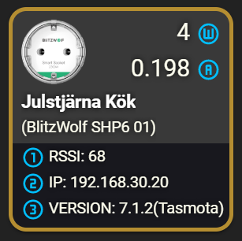

An example of a custom button card showing information from a BlitzWolf SHP6 Smart PowerPlug and controll it and shows additional informations

FEATURES:
* Tap = Shows more info on the *_status sensor
* Double Tap = Shows more info of power consumption
* Hold = Toggle the switch

INFORMATION:

* Top line 1 (right): Shows _energy_power sensor (watts)
* Top line 2 (right): Shows _energy_current sensor (amps)
* Top line 3 (left): Shows "name"
* Top line 4 (left): Shows "friendly_name"

* Bottom line 1 (left): Shows RSSI from *_status sensor
* Bottom line 2 (left): Shows IPAdress from *_status sensor
* Bottom line 3 (left): Shows Version from *_status sensor

VISUALS:

* Border color represents light on/off (Yellow = On , White = Off)
